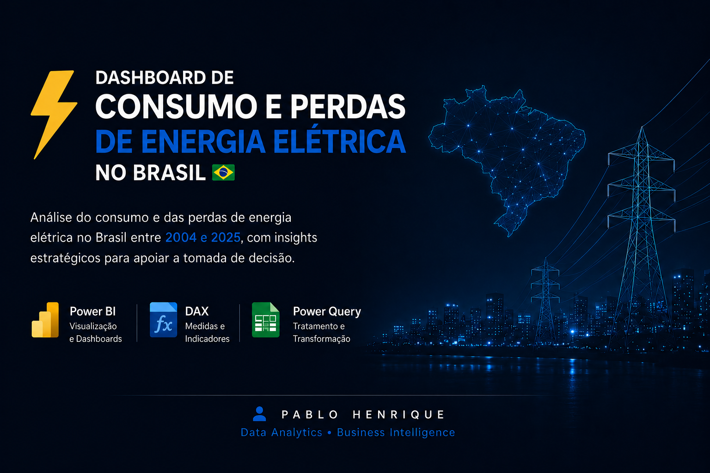
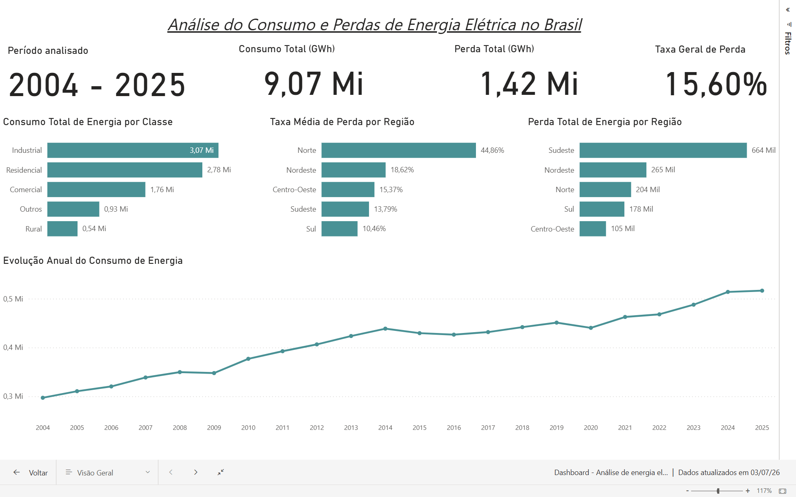
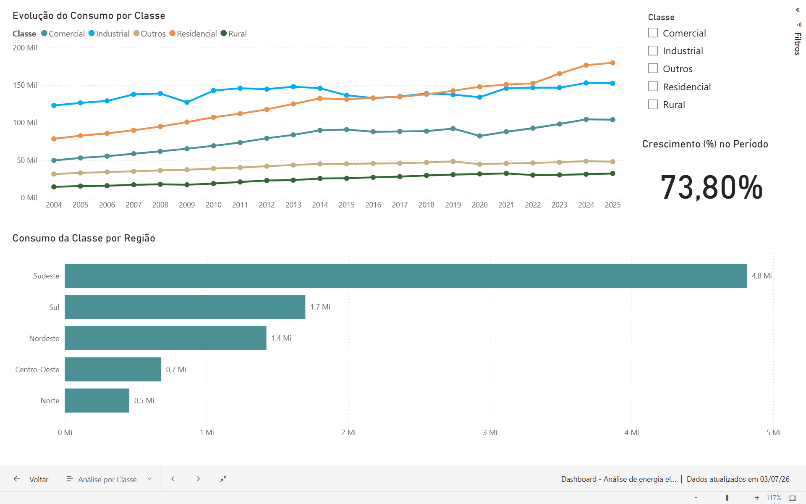
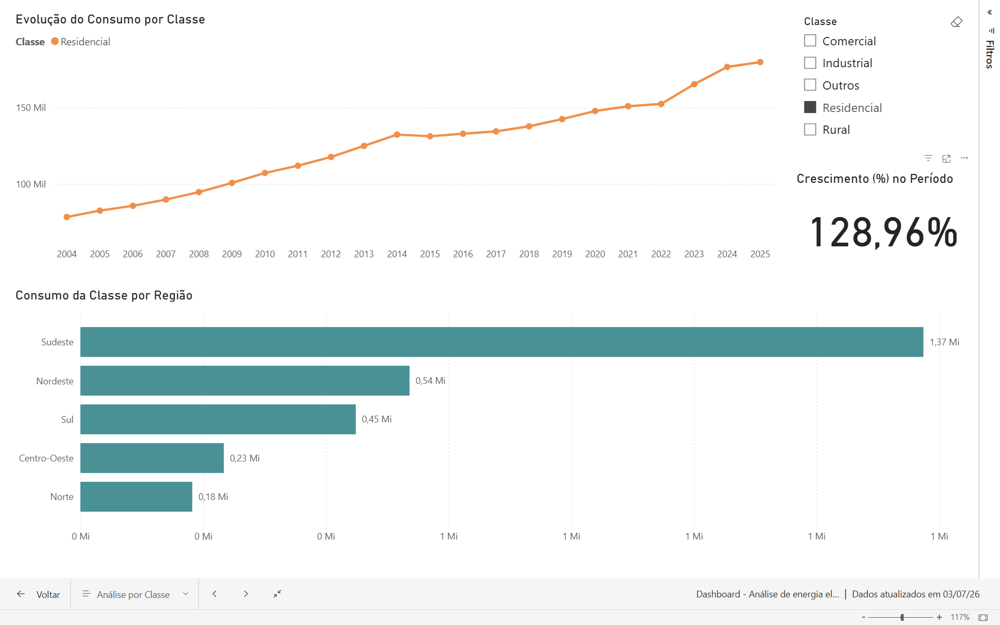
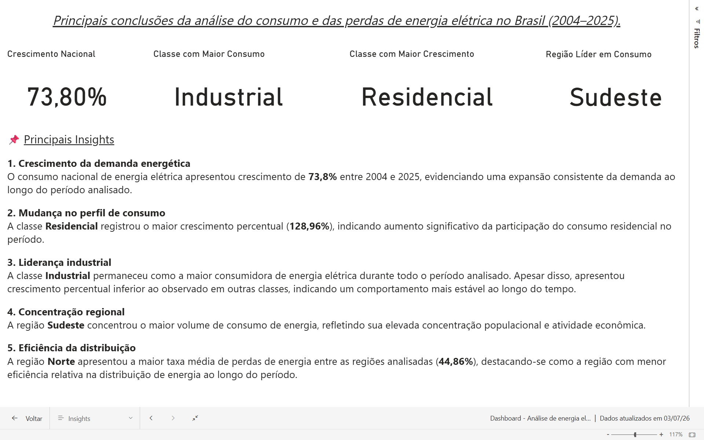

# ⚡ Dashboard de Consumo e Perdas de Energia Elétrica no Brasil

## 📖 Sobre o Projeto

Este projeto foi desenvolvido em **Power BI** com o objetivo de analisar o consumo e as perdas de energia elétrica no Brasil entre **2004 e 2025**, transformando dados históricos em informações estratégicas para apoio à tomada de decisão.

O dashboard foi construído aplicando conceitos de **ETL**, modelagem de dados, medidas em **DAX**, criação de indicadores (KPIs) e **storytelling com dados**, permitindo uma visão executiva da evolução do consumo energético brasileiro.

---

# 🎯 Objetivos

- Analisar a evolução do consumo de energia elétrica no Brasil.
- Comparar o comportamento das diferentes classes consumidoras.
- Avaliar perdas de energia entre as regiões brasileiras.
- Identificar tendências de crescimento ao longo do período.
- Apresentar insights estratégicos para apoio à tomada de decisão.

---

# 🛠 Tecnologias Utilizadas

- Power BI Desktop
- Power Query
- DAX (Data Analysis Expressions)
- Microsoft Excel / CSV

---

# 📊 Estrutura do Dashboard

## 📌 Página 1 — Visão Geral

Apresenta uma visão executiva dos principais indicadores.

**KPIs**

- Consumo Total (GWh)
- Perda Total (GWh)
- Taxa Geral de Perda
- Período Analisado

**Visualizações**

- Evolução anual do consumo
- Consumo por classe
- Perdas por região
- Taxa média de perda por região

---

## 📌 Página 2 — Análise por Classe

Permite comparar todas as classes consumidoras ou analisar uma classe específica.

**Recursos**

- Evolução histórica por classe
- Comparação entre classes
- Consumo por região
- Crescimento percentual da classe selecionada
- Navegação entre páginas
- Título dinâmico

---

## 📌 Página 3 — Insights Estratégicos

Resumo executivo com os principais resultados encontrados durante a análise.

Indicadores apresentados:

- Crescimento Nacional
- Classe com Maior Consumo
- Classe com Maior Crescimento
- Região com Maior Consumo

---

# 📈 Principais Insights

- O consumo nacional de energia elétrica cresceu **73,8%** entre 2004 e 2025.
- A classe **Residencial** apresentou o maior crescimento percentual (**128,96%**).
- A classe **Industrial** permaneceu como a maior consumidora de energia elétrica.
- A região **Sudeste** concentrou o maior volume de consumo de energia.
- A região **Norte** apresentou a maior taxa média de perdas entre as regiões analisadas.

---

# 📷 Prévia do Dashboard

## Visão Geral

---

## Análise por Classe

---

### Exemplo de interação

O dashboard permite analisar individualmente cada classe consumidora utilizando filtros dinâmicos.

---

## Insights Estratégicos

---

# 💡 Competências Demonstradas

Durante o desenvolvimento deste projeto foram aplicados conhecimentos em:

- ETL
- Power Query
- Modelagem de Dados
- DAX
- Business Intelligence
- Data Visualization
- Storytelling com Dados
- Desenvolvimento de KPIs
- Dashboards Executivos

---

# 👨‍💻 Autor

**Pablo Henrique Barbosa Silva**

🔗 LinkedIn: www.linkedin.com/in/pablo-henrique-barbosa-silva-53a4a1314

---

> Projeto desenvolvido para fins de estudo e portfólio em Business Intelligence e Análise de Dados.
